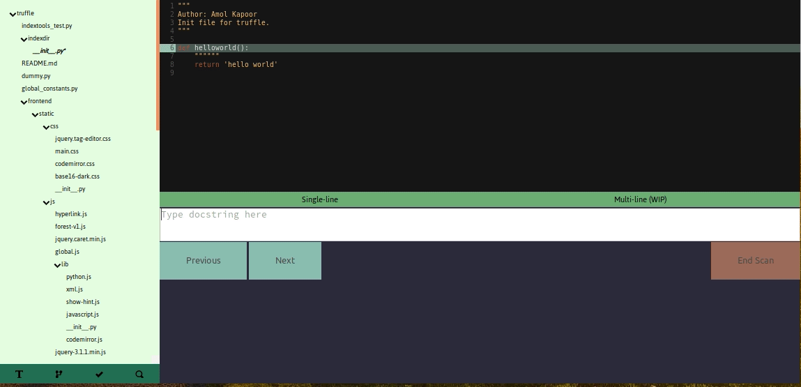

# Truffle

Truffle is a browser-based code editor that harnesses Flask and CodeMirror to create a fun and easy-to-use development environment. I started this project after noticing that large, rapidly developed codebases tend to lose their readability quickly, especially since developers become too lazy to write documentation for individual functions/classes. Truffle makes it easy for developers to run through a Python codebase and write docstrings, with keyboard shortcuts to optimize efficiency.

Currently, the project features are best equipped to handle Python code, with multilanguage support in the works.

## Features
- Browser-based - Feel free to use Truffle with your favorite browser, without having to switch applications between your code and web project

- Rapid Commenting - Quickly document your Python code, and add tags for organization.

- Code Visualization - Visualize your Python code to find common call flows and identify how the complex pieces combine to form a working whole.

- Full Code Search - As said on the box. Full code text search.

